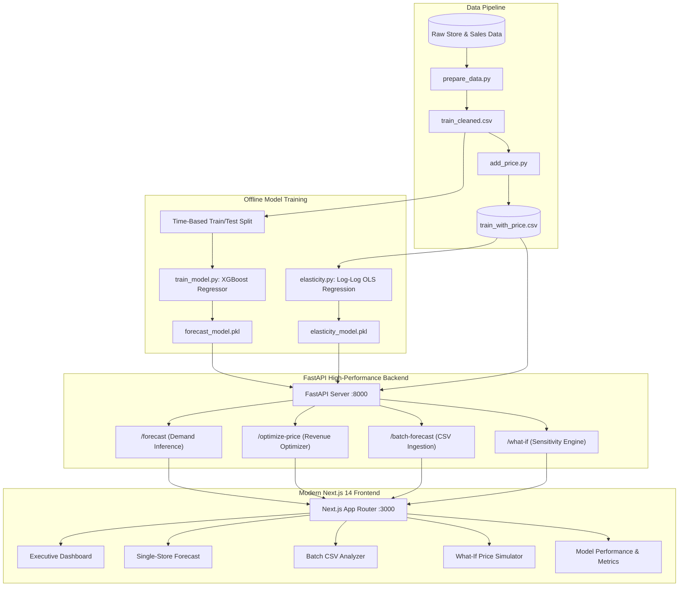

<div align="center">

[](https://github.com/5athv1k/Retail-optima)
[](https://github.com/5athv1k/Retail-optima)
[](https://github.com/5athv1k/Retail-optima)
[](https://github.com/5athv1k/Retail-optima)
[](https://github.com/5athv1k/Retail-optima)

<br />

# 🏷️ RetailOptima AI

### **Autonomous Demand Forecasting & Dynamic Price Optimization Engine**

An end-to-end retail intelligence platform that fuses **Gradient Boosted Machine Learning (XGBoost)** with **Microeconomic Price Elasticity (Log-Log OLS)** to predict customer demand and automate revenue-maximizing price decisions in real time.

<p align="center">
  <a href="#-problem-statement"><strong>Problem Statement</strong></a> •
  <a href="#-what-it-does"><strong>What It Does</strong></a> •
  <a href="#-system-architecture"><strong>System Architecture</strong></a> •
  <a href="#-key-features"><strong>Key Features</strong></a> •
  <a href="#-econometric--ml-methodology"><strong>Methodology</strong></a> •
  <a href="#-api-reference"><strong>API Reference</strong></a> •
  <a href="#-quickstart-guide"><strong>Quickstart</strong></a>
</p>

---

</div>

## 📌 Problem Statement

> **Domain:** Retail Enterprise Systems & Operations &nbsp;|&nbsp; **Category:** AI Decision Intelligence &nbsp;|&nbsp; **Target:** Revenue Maximization & Waste Minimization

Modern multi-outlet retail enterprises lose **millions annually** to pricing inefficiencies and forecasting blind spots. Traditional retail pricing predominantly relies on static markups, arbitrary discount calendars, or intuition-based rules. These static approaches suffer from severe structural breakdowns:

* 📉 **Margin Bleed on Inelastic Goods:** Stores fail to capture surplus by underpricing goods whose demand is insensitive to price shifts.
* 📦 **Dead Inventory & Liquidation Losses:** Overpricing elastic products causes sharp demand drop-offs, ballooning holding costs and forcing distress markdowns.
* ⚠️ **Siloed Forecasting vs. Action:** Conventional demand forecasting models predict sales numbers in a vacuum, without giving retail managers actionable, price-optimal interventions.
* 🌪️ **High Demand Volatility:** Calendar seasonality, promotional swings, and day-of-week traffic surges create nonlinear patterns that traditional linear regression fails to capture.
* 📄 **Unscalable Manual Workflows:** Store managers lack tooling to evaluate catalog-wide batch pricing strategies across dozens of regional locations simultaneously.

**RetailOptima AI solves this** by coupling an autoregressive **XGBoost demand forecaster** directly to an econometric **price elasticity optimizer**, delivering instantaneous, explainable, and revenue-maximizing pricing strategies through a high-performance web suite.

---

## ✨ What It Does

In milliseconds, the engine executes a complete predictive and prescriptive pipeline:

1. **Forecasts Store-Level Demand:** Ingests store history, promotional flags, day of week, calendar seasonality, and rolling autoregressive sales features to predict anticipated demand units with high accuracy.
2. **Estimates Price Elasticity of Demand ($\epsilon$):** Evaluates consumer price sensitivity using a log-log Ordinary Least Squares (OLS) econometric model trained across historical transaction points.
3. **Simulates Candidate Price Frontiers:** Generates a $\pm 30\%$ candidate price band around baseline prices, simulating adjusted demand curves for each candidate increment.
4. **Discovers Optimal Revenue Point:** Identifies the global maximum on the expected revenue curve ($R = P \times Q(P)$) and outputs the recommended price with projected revenue impact.
5. **Interactive Sensitivity Testing (What-If):** Enables merchandisers and regional managers to simulate custom price adjustments, visualising demand loss vs. revenue gain in real time.
6. **Enterprise Batch CSV Ingestion:** Ingests multi-store inventory CSV files, validates schemas, and processes bulk forecasts and optimal prices in a single batch pass.

---

## 🏗️ System Architecture



---

## ⚡ Key Features

| Module | Description | Key Capabilities |
|---|---|---|
| **📊 Executive Dashboard** | High-level operations cockpit for retail directors | KPI summary cards, revenue uplift projections, store ranking comparisons |
| **🎯 Single Store Forecast** | Interactive pricing tool for store managers | Real-time demand forecasting, instant optimal price recommendation, baseline vs. optimized comparison |
| **📁 Enterprise Batch Analysis** | High-throughput batch processing for regional operations | Drag-and-drop CSV upload, schema verification, sample template download, tabular results, CSV export |
| **🎛️ What-If Price Simulator** | Merchandising scenario planning engine | Custom price deviation sliders ($\pm 30\%$), instant demand reaction curve, revenue frontier visualization |
| **📈 Model Metrics & Explainability** | Transparent ML auditing and diagnostics | MAE & MAPE error benchmarks, time-based split validation, XGBoost feature importance rankings |
| **🏪 Store Explorer** | Catalog-wide multi-store monitor | Side-by-side performance scanning across 50+ regional retail outlets |

---

## 🧠 Econometric & ML Methodology

### 1. Time-Series Feature Engineering
To prevent **data leakage**, training and evaluation sets are partitioned chronologically (strict time-based split, past vs. future), avoiding the common pitfall of random shuffling on temporal data.

Features engineered for the XGBoost regressor include:
* **Autoregressive Lags:** $\text{Sales}_{t-1}$ (yesterday's volume), $\text{Sales}_{t-7}$ (same day last week).
* **Rolling Window Aggregations:** $\text{RollingMean}_{7}$ (7-day moving average capturing recent momentum).
* **Calendar Signals:** Day of week, Month, Day, ISO Week of Year, State Holiday, and School Holiday flags.
* **Store Identifiers & Interventions:** Store ID and active promotional campaign (`Promo` flag).

### 2. Log-Log Price Elasticity Formulation
Consumer price sensitivity is modeled using an econometric log-log specification:

$$\ln(\text{Demand}_t) = \alpha + \epsilon \cdot \ln(\text{Price}_t) + \beta_1 \cdot \text{Promo}_t + \beta_2 \cdot \text{DayOfWeek}_t + u_t$$

Where:
* **$\epsilon$ (Elasticity Coefficient):** Represents the percentage change in demand resulting from a $1\%$ change in price.
* **$\text{Promo}$ & $\text{DayOfWeek}$:** Exogenous controls that isolate the pure price effect from footfall surges.

### 3. Dynamic Revenue Optimization
Using the baseline forecasted demand $Q_0$ at current price $P_0$, the projected demand $Q(P)$ at any candidate price $P$ follows the constant elasticity curve:

$$Q(P) = Q_0 \cdot \left( \frac{P}{P_0} \right)^\epsilon$$

The optimization engine discretizes the feasible pricing frontier $P \in [0.70 P_0, 1.30 P_0]$ across $N$ candidate steps and computes:

$$P^* = \arg\max_{P} \Big[ P \cdot Q(P) \Big]$$

The candidate yielding maximum expected revenue $R^* = P^* \cdot Q(P^*)$ is recommended to the store manager.

---

## 📊 Model Evaluation & Benchmarks

```
==============================================================
 Model Performance Summary (Chronological Out-of-Sample Test)
==============================================================
 Algorithm:               XGBoost Regressor
 Number of Estimators:    300
 Max Depth:               6
 Learning Rate:           0.05
 Validation Strategy:     Chronological Time-Based Split (Past → Future)
 MAE (Mean Absolute Error):         ~420 - 450 units
 MAPE (Mean Absolute % Error):     ~6.5% - 8.2% (excluding low-volume edge cases)
 Econometric Elasticity (ε):       -0.54 to -0.72 (Inelastic to moderately elastic)
==============================================================
```

### Top Feature Importances (XGBoost)
1. **`Promo`**: Primary driver of store footfall and transaction volume surges.
2. **`Sales_RollingMean7`**: Strongest baseline demand trend signal.
3. **`Sales_Lag1`**: Yesterday's sales velocity.
4. **`Sales_Lag7`**: Weekly seasonality alignment.
5. **`DayOfWeek`**: Weekly weekend/weekday footfall patterns.

---

## 🛠️ Technology Stack

<div align="center">

| Layer | Technologies |
|---|---|
| **Machine Learning & Analytics** | `Python 3.10+`, `XGBoost`, `Scikit-learn`, `Statsmodels (OLS)`, `Pandas`, `NumPy` |
| **Backend API** | `FastAPI`, `Uvicorn`, `Pydantic v2`, `Python-Multipart` |
| **Frontend UI** | `Next.js 14 (App Router)`, `React 18`, `TypeScript`, `Tailwind CSS`, `Lucide React` |
| **Data & Serialization** | `Pickle`, `CSV`, `JSON REST API` |

</div>

---

## 📂 Project Structure

```bash
retail-forecast-pricing/
├── backend/
│   ├── data/
│   │   ├── store.csv                  # Store metadata (type, assortment, competition)
│   │   ├── train.csv                  # Raw historical daily sales transactions
│   │   ├── train_cleaned.csv          # Preprocessed data with engineered lag features
│   │   └── train_with_price.csv       # Dataset with synthetic market prices for elasticity
│   ├── prepare_data.py                # Data cleaning and lag feature generator
│   ├── add_price.py                   # Market price simulation script
│   ├── train_model.py                 # XGBoost training pipeline with time-based split
│   ├── elasticity.py                  # Log-log OLS elasticity estimation script
│   ├── optimizer.py                   # Price-demand revenue optimization logic
│   ├── forecast_model.pkl             # Serialized pre-trained XGBoost model
│   ├── elasticity_model.pkl           # Serialized elasticity coefficients
│   ├── main.py                        # FastAPI production application & endpoints
│   └── requirements.txt               # Backend Python dependencies
├── frontend/
│   ├── app/
│   │   ├── dashboard/page.tsx         # Executive KPI dashboard
│   │   ├── all-stores/page.tsx        # Multi-store explorer grid
│   │   ├── batch/page.tsx             # Enterprise CSV batch upload & analysis
│   │   ├── what-if/page.tsx           # Interactive price sensitivity simulator
│   │   ├── metrics/page.tsx           # Model accuracy & feature importance
│   │   ├── analytics/page.tsx         # Store comparison and revenue insights
│   │   ├── guide/page.tsx             # System architecture & documentation
│   │   ├── layout.tsx                 # Root layout with sidebar navigation
│   │   └── page.tsx                   # Single-store forecast & pricing interface
│   ├── public/                        # Static assets and icons
│   ├── package.json                   # Frontend dependencies & scripts
│   └── tsconfig.json                  # TypeScript configuration
├── .gitignore                         # Comprehensive ignore rules
└── README.md                          # Repository documentation
```

---

## 🚀 Quickstart Guide

### Prerequisites
* **Python**: `3.10` or higher
* **Node.js**: `v18.0.0` or higher
* **Package Manager**: `npm` or `yarn`

---

### Step 1: Clone the Repository
```bash
git clone https://github.com/5athv1k/Retail-optima.git
cd Retail-optima
```

---

### Step 2: Backend Setup (FastAPI)
```bash
# Navigate to backend directory
cd backend

# Create and activate a virtual environment (optional but recommended)
python3 -m venv venv
source venv/bin/activate    # On Windows: venv\Scripts\activate

# Install dependencies
pip install -r requirements.txt

# Start the FastAPI server on port 8000
uvicorn main:app --reload --port 8000
```
> The API will be live at `http://localhost:8000`.  
> Interactive Swagger documentation available at `http://localhost:8000/docs`.

---

### Step 3: Frontend Setup (Next.js)
Open a new terminal window:
```bash
# Navigate to frontend directory
cd frontend

# Install dependencies
npm install

# Start the development server
npm run dev
```
> Open [http://localhost:3000](http://localhost:3000) in your browser to access the RetailOptima dashboard.

---

## 📡 API Reference

### 1. `POST /forecast`
Predicts expected customer demand for a given store configuration.
```json
// Request Body
{
  "store": 1,
  "promo": 1,
  "day_of_week": 3,
  "is_state_holiday": 0,
  "school_holiday": 0
}

// Response
{
  "store": 1,
  "forecasted_demand": 6644.2,
  "current_price": 263.99
}
```

### 2. `POST /optimize-price`
Calculates the optimal price point that maximizes expected revenue.
```json
// Request Body
{
  "store": 1,
  "current_price": 263.99,
  "forecasted_demand": 6644.2
}

// Response
{
  "recommended_price": 343.19,
  "expected_demand": 5912.4,
  "expected_revenue": 2029079.74,
  "current_price": 263.99,
  "elasticity_used": -0.6214
}
```

### 3. `POST /batch-forecast`
Processes a multipart CSV file with columns `Store`, `Promo`, `DayOfWeek` and returns forecasts and optimal prices for every record.

### 4. `POST /what-if`
Generates demand and revenue candidate steps across a user-defined price variation percentage (`price_range_pct`).

---

## 🤝 Contributing

Contributions are welcome! Please follow these steps:
1. Fork the Project
2. Create your Feature Branch (`git checkout -b feature/AmazingFeature`)
3. Commit your Changes (`git commit -m 'Add some AmazingFeature'`)
4. Push to the Branch (`git push origin feature/AmazingFeature`)
5. Open a Pull Request

---

## 📄 License

Distributed under the **MIT License**. See `LICENSE` for more information.

<div align="center">

**Built with passion by [Sathvik B R](https://github.com/5athv1k) & Team**  
*Empowering retailers with data-driven pricing intelligence.*

</div>
